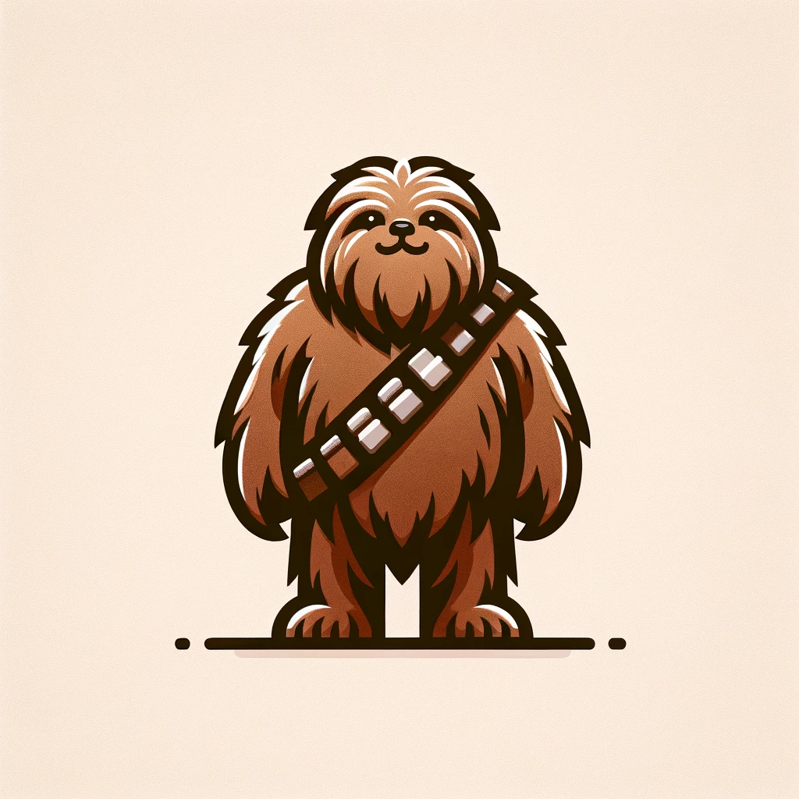

<!-- import the image.webp -->

<p align="center">
  
</p>


## Installation

Create the conda environment `conda create -n chewbacca_1 python=3.10`. xformers require python>=3.10

then install [PyTorch 2.0](https://pytorch.org/get-started/locally/) dependency, and istall other packages here:


```bash
# conda install pytorch==2.2.0 torchvision==0.17.0 torchaudio==2.2.0 pytorch-cuda=11.8 -c pytorch -c nvidia
conda install pytorch==2.2.0 torchvision==0.17.0 torchaudio==2.2.0 pytorch-cuda=12.1 -c pytorch -c nvidia
pip install hydra-core
pip install lightning
pip install pyrootutils
pip install submitit
pip install rich
pip install opencv-python
pip install dill
pip install scipy
pip install colordict
pip install wandb
pip install joblib
pip install git+https://github.com/brjathu/PHALP.git
pip install joblib
pip install webdataset
pip install decord
pip install moviepy
pip install transformers
pip install matplotlib
conda install xformers -c xformers
pip install dall_e
pip install peft
pip install tensorboard
pip install deepspeed
pip install Ninja # for gsplat, and deepspeed
pip install hydra-submitit-launcher
pip install git+https://github.com/nerfstudio-project/gsplat.git@v0.1.0
pip install git+https://github.com/brjathu/LART
pip install torchmetrics[image]
pip install diffusers
pip install -e .
```


## Usage

see specific projects.
